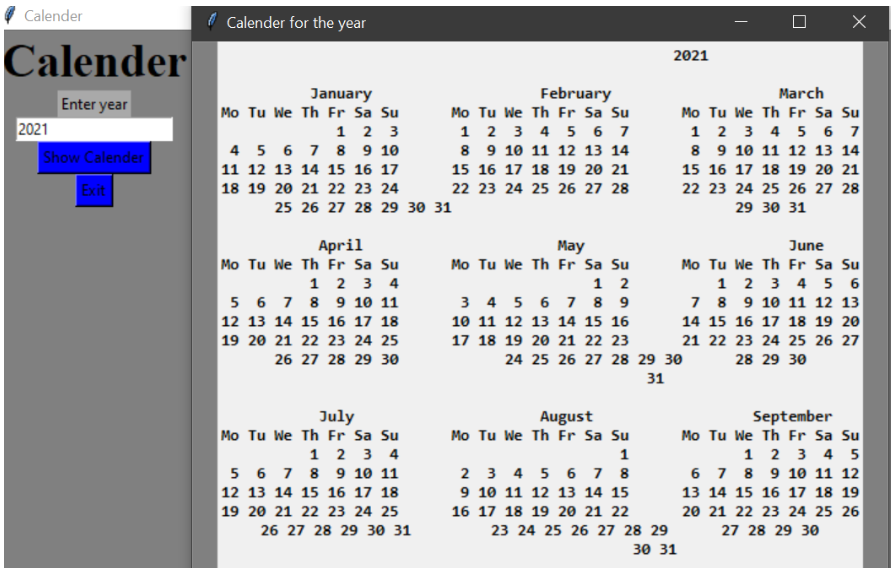

# Python GUI Calendar Application 📅

This project is a simple Python GUI application that displays a full calendar for a given year. It is built using Tkinter and Python's built-in calendar module.

---

## 🚀 Features
- Simple graphical interface
- Accepts year input from the user
- Displays full calendar for the entered year
- Uses built-in Python modules only

---

## 🛠 Technologies Used
- Python 3
- Tkinter (GUI)
- calendar module

---

## 📂 Project Structure
python-gui-calendar-tkinter/
│
├── main.py
├── README.md
├── requirements.txt
└── screenshot.png

---

## 🧠 How the Application Works
- The user enters a year in the input field.
- Clicking Show Calendar opens a new window.
- The calendar module generates the calendar.
- The calendar is displayed using a Label widget.

---

## 🖼 Application Screenshot

---

## 📌 Notes
- Tkinter comes pre-installed with Python.
- No external dependencies required.

---

## 🔁 Reusability
You can:
- Modify password length logic
- Improve GUI design
- Integrate with login systems
- Use in educational learning projects

---

## 🤝 Contribution
Pull requests are welcome.  
If you'd like to improve this project, feel free to fork the repository and submit enhancements.

---

## ❤️ Support
If this project helped you:
⭐ Star the repository  
📢 Share it with others  
Happy Coding!
